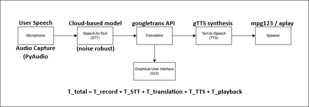
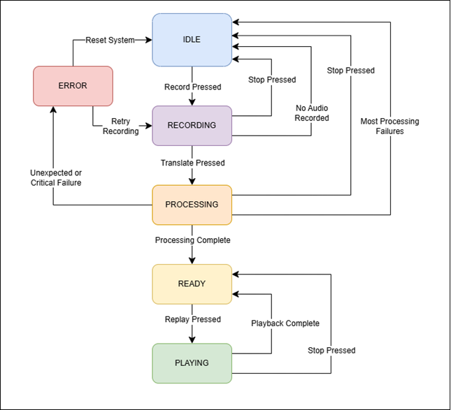
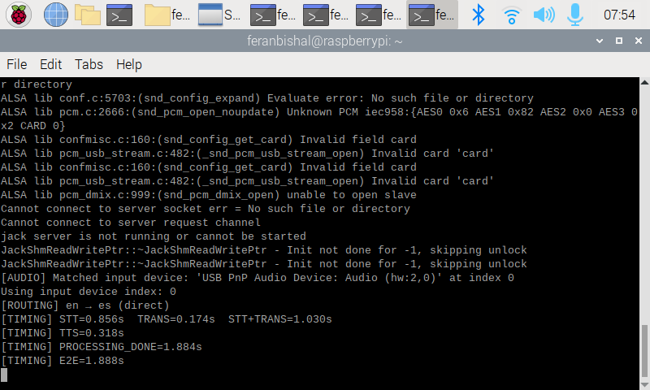
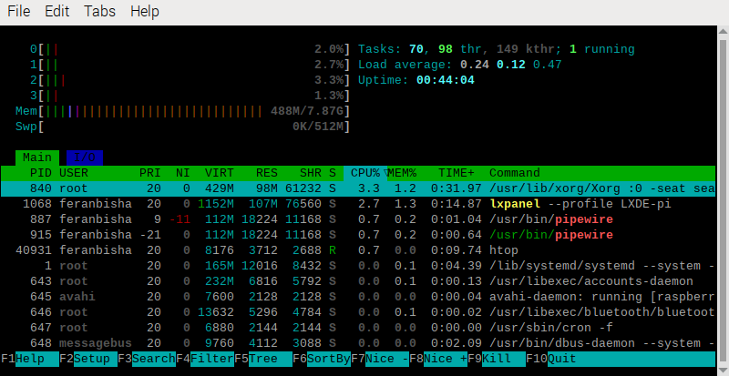
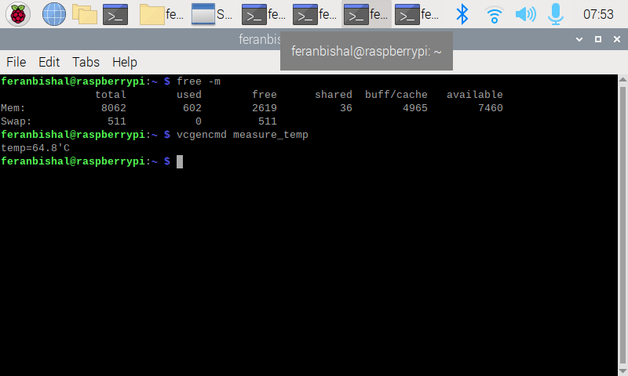
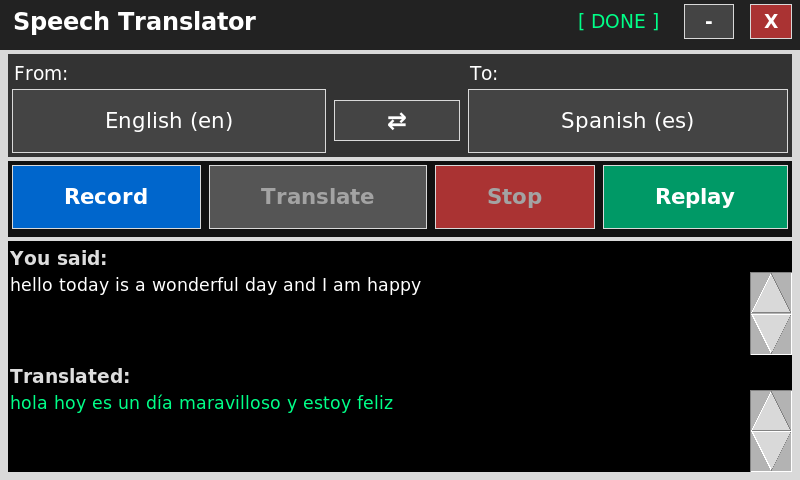

# Wireless Embedded Speech Translation Device

**(Python · Raspberry Pi · STT/Translation/TTS Pipeline · Real-Time System Design)**

## Overview

This project implements a near real-time, user-triggered speech-to-speech translation system on an embedded platform (Raspberry Pi). The system captures spoken input, converts it to text, translates it into a target language, and plays back synthesized speech.

The architecture is designed as an event-driven pipeline with clear separation between audio capture, processing, and playback stages.

---

## System Architecture

User Input → Audio Capture → Speech-to-Text → Translation → Text-to-Speech → Playback

- Audio Capture: Microphone input (PyAudio)
- Speech-to-Text (STT): Cloud-based recognition
- Translation: Language translation engine
- Text-to-Speech (TTS): Synthesized audio output
- Playback: System-level audio playback

The system operates in a best-effort near real-time mode, with measured end-to-end latency from recording to playback initiation.

### Architecture Diagram


---

## Key Features

- Real-time speech recording with user-triggered control
- Multi-language translation support
- Event-driven processing pipeline
- GUI-based interaction (Tkinter, touchscreen optimized)
- Audio playback with replay capability
- Language validation for STT/TTS compatibility
- Error handling for:
  - No audio input
  - Recognition failure
  - Translation failure
  - TTS unavailability

---
  
## System Design

### State Management (GUI)

The system behaves like a controlled state machine:

- IDLE → waiting for user input
- RECORDING → capturing audio
- PROCESSING → STT + translation + TTS
- READY → output available
- PLAYING → audio playback
- ERROR → failure state

This ensures predictable transitions and avoids race conditions during concurrent operations.

---

### Concurrency Model

- GUI runs on the main thread
- Processing tasks run on worker threads
- Threading prevents UI blocking during:
  - speech recognition
  - translation
  - TTS generation

---

## State Machine


---

## Performance Model

Total system latency:

T_total = T_record + T_STT + T_translation + T_TTS + T_playback

Measured end-to-end latency (to playback start) is logged during execution.

---

## Experimental Results

### End-to-End Latency


### CPU Utilization


### Memory & Temperature


### Translation Example


---

## Repository Structure

```text
.
speech-translation-device/
├── main.py
├── Tcore.py                 # Core pipeline (original implementation)
├── Tgui.py                  # GUI (original implementation)
├── requirements.txt
├── README.md
└── src/
    ├── audio/
    │   └── recorder.py
    ├── core/
    │   └── pipeline.py
    ├── gui/
    │   └── interface.py
    ├── stt/
    │   └── speech_to_text.py
    ├── translation/
    │   └── translator.py
    └── tts/
        └── text_to_speech.py
```

Note:

- Tcore.py and Tgui.py represent the original integrated implementation.
- The src/ directory reflects a modularized architecture for scalability and maintainability.

---

## Installation

### 1. Clone the repository

```Bash
git clone https://github.com/oluwaferanmi-arowoshola/speech-translation-device.git
cd speech-translation-device
```

### 2. Install Python dependencies

```Bash
pip install -r requirements.txt
```

---

## System Requirements

This project was developed and tested on:

- Raspberry Pi (Linux-based OS)
- Python 3.x
- USB microphone
- Audio output device (speaker)

### Required system tools

Install on Linux (Raspberry Pi):

```Bash
sudo apt-get install mpg123 alsa-utils
```

### How to Run

```Bash
python main.py
```

---

## Usage Flow

1. Select source and target languages
2. Press Record
3. Speak into the microphone
4. ress Translate
5. System processes:
  - Speech recognition
  - Translation
  - Speech synthesis
6. Translated audio is played automatically
7. Press Replay to hear it again

---

## Limitations

- Depends on cloud-based STT and translation services
- Performance varies with network latency
- Microphone selection defaults to system device (not explicitly bound)
- Not hard real-time (best-effort timing)

---

## Future Improvements

- Offline STT/TTS models for full edge deployment
- Explicit audio device selection
- Latency optimization (pipeline parallelism)
- Hardware integration (buttons, dedicated UI)
- Multilingual fallback routing

---

## Author

Oluwaferanmi Arowoshola
M.S. Electrical & Computer Engineering
Embedded Systems · Real-Time Systems · IoT

---

## Key Takeaway

This project demonstrates end-to-end embedded system design, combining:

- real-time audio processing
- distributed AI services
- GUI interaction
- system-level integration

into a cohesive, deployable application.
