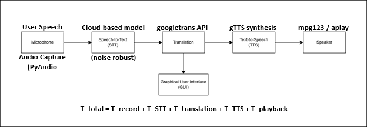

# Wireless Embedded Speech Translation Device

**Python · Raspberry Pi · Embedded Linux · Audio Processing · STT/Translation/TTS Pipeline · GUI · Performance Validation**

## Overview

This project implements a best-effort near real-time, user-triggered speech-to-speech translation system on a Raspberry Pi embedded Linux platform. The system captures spoken input through a USB microphone, converts the speech to text, translates the recognized text into a target language, generates synthesized speech, and plays back the translated audio.

The project was designed as an event-driven embedded system pipeline with separate stages for audio capture, speech recognition, translation, text-to-speech generation, playback, and GUI control. The implementation includes state-based GUI behavior, worker-thread processing to reduce UI blocking, error handling for audio/service failures, and performance validation using latency, CPU, memory, and temperature observations.

## Project Purpose

The goal of this project was to build a functional embedded speech translation prototype that combines software services, Linux audio handling, GUI control, and system-level performance monitoring on Raspberry Pi hardware.

This project demonstrates:

- Embedded Linux application development on Raspberry Pi
- Audio input/output integration using USB microphone and speaker playback
- Speech-to-text, translation, and text-to-speech pipeline integration
- GUI-based user interaction
- State-machine-based control flow
- Multithreaded processing to keep the interface responsive
- Error handling for audio, recognition, translation, and playback failures
- Basic performance validation for latency, CPU usage, memory usage, and device temperature

## System Architecture

The system follows a sequential audio-processing pipeline:

```text
User Speech
    ↓
Audio Capture
    ↓
Speech-to-Text
    ↓
Translation
    ↓
Text-to-Speech
    ↓
Audio Playback
    ↓
Replay / New Recording
```

The GUI controls the pipeline and displays system state transitions during recording, processing, translation, playback, and error handling.

## Architecture Diagram



## Key Features

- Real-time user-triggered speech recording
- Speech-to-text conversion
- Multi-language translation support
- Text-to-speech audio generation
- Automatic translated audio playback
- Replay capability for generated translated speech
- GUI-based interaction
- State-based system behavior
- Worker-thread processing to reduce GUI blocking
- Error handling for:
  - no audio input
  - speech recognition failure
  - translation failure
  - text-to-speech failure
  - audio playback issues
- Performance observation for latency, CPU usage, memory usage, and temperature

## Embedded/System-Level Focus

This project was designed and tested on Raspberry Pi hardware rather than only in a desktop environment. The implementation accounts for embedded-system concerns such as:

- USB microphone input on Linux
- Audio playback using Linux audio tools
- GUI responsiveness on constrained hardware
- CPU and memory usage during speech processing
- Device temperature monitoring
- Best-effort latency measurement from recording to playback start
- Handling failures from audio devices, cloud services, and generated speech playback

Although the system uses cloud-based STT, translation, and TTS services, the integration, interface control, audio handling, and performance observation were implemented and tested as an embedded Linux prototype.

## System Design

### GUI State Management

The GUI behaves as a controlled state machine with the following major states:

```text
IDLE        → waiting for user input
RECORDING   → capturing audio
PROCESSING  → speech-to-text, translation, and TTS generation
READY       → translated audio available
PLAYING     → translated audio playback
ERROR       → failure state
```

This structure helps keep the interface predictable and reduces race conditions during concurrent operations.

## State Machine


## Concurrency Model

The project separates GUI control from processing tasks so that long-running operations do not freeze the interface.

General concurrency model:

- GUI runs on the main thread
- Audio capture and processing tasks run separately
- Worker execution is used during:
  - speech recognition
  - translation
  - text-to-speech generation
  - playback handling

This improves responsiveness compared with a fully blocking implementation.

## Translation Example


Example flow:

1. Select the source and target languages
2. Press **Record**
3. Speak into the microphone
4. Press **Translate**
5. The system performs:
   - speech recognition
   - translation
   - speech synthesis
6. Translated audio plays automatically
7. Press **Replay** to hear the translated output again

## Performance Model

The total system latency can be represented as:

```text
T_total = T_record + T_STT + T_translation + T_TTS + T_playback_start
```

The project measures end-to-end timing from recording completion to translated audio playback start.

## Experimental Results

### End-to-End Latency


Observed result:

```text
End-to-end latency to playback start: approximately 2–3 seconds
```

Latency depends on:

- network conditions
- speech length
- cloud STT response time
- translation service response time
- TTS generation time
- Raspberry Pi processing load

### CPU Utilization


CPU usage was observed during application execution to evaluate whether the Raspberry Pi could handle GUI interaction, audio processing, and service calls without becoming unresponsive.

### Memory and Temperature


Memory usage and device temperature were monitored during execution to evaluate system behavior on Raspberry Pi hardware.

## Performance Summary

| Metric | Observed Result | Notes |
|---|---:|---|
| End-to-end latency | ~2–3 seconds | Measured from processing to playback start |
| CPU usage | Observed during execution | Captured while running the application |
| Memory usage | Observed during execution | Checked during Raspberry Pi operation |
| Temperature | Observed during execution | Used to monitor embedded hardware behavior |

## Repository Structure

```text
speech-translation-device/
├── assets/
│   └── audio/              # Audio-related assets or generated audio samples
│
├── docs/                   # Architecture diagrams, screenshots, and performance captures
│
├── src/                    # Modularized project structure
│   ├── audio/              # Audio recording logic
│   ├── core/               # Pipeline orchestration
│   ├── gui/                # GUI interface
│   ├── stt/                # Speech-to-text wrapper
│   ├── translation/        # Translation wrapper
│   └── tts/                # Text-to-speech wrapper
│
├── Tcore.py                # Original core pipeline implementation
├── Tgui.py                 # Original GUI implementation
├── main.py                 # Application entry point
├── requirements.txt        # Python dependencies
├── README.md
└── LICENSE
```

## Implementation Note

`Tcore.py` and `Tgui.py` represent the original integrated implementation. The `src/` directory reflects a modular project structure for maintainability and future scaling.

The current application entry point is:

```bash
python main.py
```

## Installation

### 1. Clone the repository

```bash
git clone https://github.com/oluwaferanmi-arowoshola/speech-translation-device.git
cd speech-translation-device
```

### 2. Install Python dependencies

```bash
pip install -r requirements.txt
```

### 3. Install Linux audio playback tools

On Raspberry Pi OS or Debian-based Linux systems:

```bash
sudo apt-get update
sudo apt-get install mpg123 alsa-utils
```

## System Requirements

This project was developed and tested with:

- Raspberry Pi
- Raspberry Pi OS / Linux-based OS
- Python 3.x
- USB microphone
- Audio output device or speaker
- Internet connection for cloud-based speech recognition, translation, and TTS services

## How to Run

Run the application with:

```bash
python main.py
```

## Usage Flow

1. Select the source and target languages.
2. Press **Record**.
3. Speak into the microphone.
4. Press **Translate**.
5. The system processes:
   - speech recognition
   - translation
   - text-to-speech generation
6. Translated audio plays automatically.
7. Press **Replay** to hear the translated output again.

## Limitations

- Uses cloud-based STT, translation, and TTS services, so performance depends on network conditions.
- Best-effort near real-time behavior only; the system is not hard real-time.
- Microphone input currently depends on the default Linux audio device configuration.
- Audio-device errors may occur if ALSA/PyAudio is not configured correctly.
- The prototype has not yet been packaged as a startup service or kiosk-style embedded application.
- Offline STT/TTS models are not currently implemented.
- Hardware button control was considered as a future improvement but is not currently integrated.

## Future Engineering Improvements

- Add explicit microphone and speaker device selection
- Add offline STT/TTS support to reduce cloud dependency
- Package the application as a `systemd` service for Raspberry Pi deployment
- Add hardware buttons for record, stop, translate, and replay control
- Add structured CSV logging for latency, CPU usage, memory usage, and temperature
- Improve pipeline parallelism to reduce end-to-end latency
- Add touchscreen/kiosk mode for embedded deployment
- Add configuration file support for language pairs and audio-device selection
- Add better exception logging and recovery for failed service calls

## Key Takeaways

This project demonstrates end-to-end embedded system design using Raspberry Pi and Python, combining:

- real-time audio processing
- distributed AI service integration
- GUI interaction
- state-machine control
- multithreaded execution
- Linux audio playback
- performance measurement
- error handling
- system-level integration

The project is not intended to be a hard real-time system. Instead, it demonstrates a practical embedded Linux prototype that integrates multiple software and hardware-facing components into a functional speech translation device.

## Author

**Oluwaferanmi Arowoshola**  
M.S. Electrical & Computer Engineering  
Embedded Systems · Real-Time Systems · IoT · FPGA · Hardware/Software Integration

## License

This project is licensed under the MIT License.
